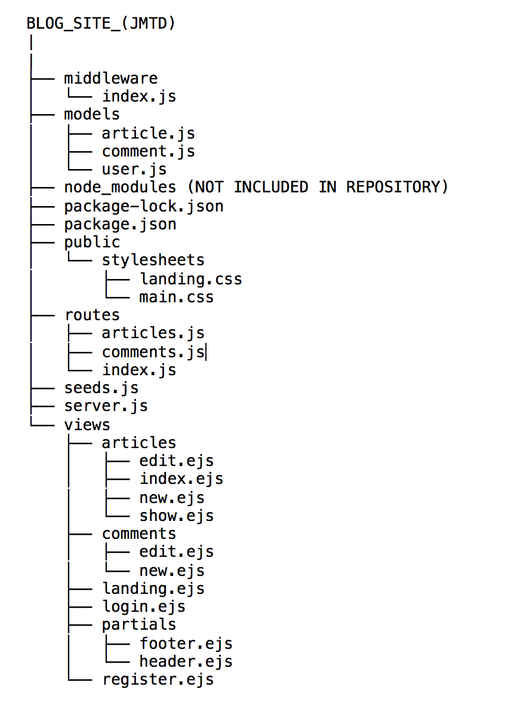

# JM Tech & Development

### Introduction

JM Tech & Development (JMTD) is a fictional blog site for developers and technology enthusiasts. 
This full-stack application allows the user to create and delete their blog posts and / or comments.
JMTD utilizes RESTful architecture and performs CRUD operations for the user (depending on his / her 
authorization / ownership). This app is connected to a MongoDB (NoSQL Database) cluster which allows 
data to get stored. Errors are handled through flash messages to provide the user with feedback.

### Link
Heroku: https://jm-tech-and-development.herokuapp.com/

### Does the code require a local web server to run?
Yes. Be sure to select Port 3000 and 0.0.0.0 IP Address on your app.js (or server.js) file.

### Directory Tree

### Technologies

1. HTML5
2. CSS3:
   * Responsive Framework: Bootstrap 4
3. JavaScript:
   * ES6
4. MongoDB (NoSQL Database)
5. Node.js (Server-side)
6. NPM Modules:
   * Ejs
   * Express / Express-Session
   * Body-Parser
   * Mongoose
   * Method-Override
   * Connect-Flash
   * Passport / Passport-Local / Passport-Local-Mongoose
   
